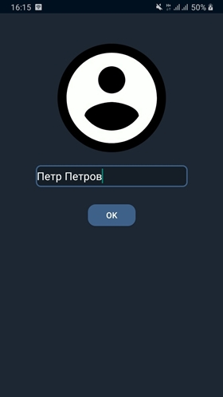

# NeuralPushkin
Приложение для удобного взаимодействия с API, которое генерирует тексты на основе полученного текста. Нейросеть обучалась по текстам Александра Сергеевича Пушкина.
Когда бэкенд будет дописан, в приложение появиться возможность добавлять факты о собеседнике, и текст будет генерироваться с учетом этих фактов и общего контекста переписки.

Почитать о генерирующей текст нейросети можно [tproger'e](https://tproger.ru/news/neural-pushkin-generiruet-tekst-na-russkomu-v-stile-pushkina-pri-pomoshhi-nejrosetej-teper-proekt-dostupen-dlja-vseh/)
, [vc](https://vc.ru/ml/275540-daydzhest-novostey-iskusstvennogo-intellekta-i-mashinnogo-obucheniya-za-iyul), и [exploit](https://www.exploit.media/note/how-to-confess-your-love-in-pushkin-style/). 

# Из чего состоит
* Состоит из двух фрагментов, "*Контакты*" и "*Сообщения*", и двух активностей - "*Добавление пользователя*" и "*Чат*". 

* Для хранения данных используется библиотека **Room**.

* Для работы с сетью используется **Retrofit** и **OkHtpp**.

Скриншоты экранов приложения представлены ниже.
|  |  |  |
| ------------------------------------------- | ------------------------------------------- |------------------------------------------- |
|  |  | 

## Идеи для улучшения приложения.

1. Хранить сущности базы данных в *LiveData*, а после используя *RxJava*.
2. Мигрировать весь код на *Kotlin*.
3. Создать класс репозиторий для получения данных в отдельном месте.

## Установка
Чтобы опробовать приложение, установите файл [PushkinApp](https://github.com/chernybro/NeuralPuskin/blob/main/Pushkin.apk) на ваше устройство.

