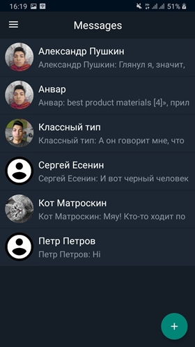

# NeuralPushkin
Приложение для удобного взаимодействия с API, которое генерирует тексты на основе полученного текста. Нейросеть обучалась по текстам Александра Сергеевича Пушкина.
Когда бэкенд будет дописан, в приложение появиться возможность добавлять факты о собеседнике, и текст будет генерироваться с учетом этих фактов и общего контекста переписки.

Скриншоты экранов приложения.
|  |  |  |
| ------------------------------------------- | ------------------------------------------- |------------------------------------------- |
|  |  | 
| ---------------------------------------------- | -------------------------------------------- | 

Идеи для улучшения приложения.

1. Хранить сущности базы данных в LiveData, а после используя RxJava.
2. Мигрировать весь код на Kotlin.
3. Создать класс репозиторий для получения данных в отдельном месте.
